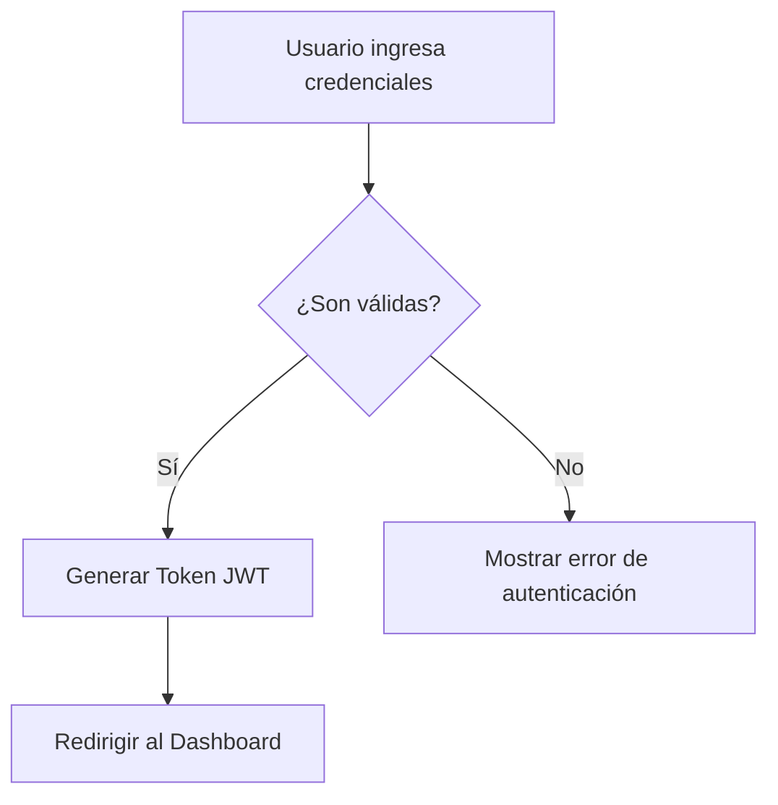

# Lección 2: Bloques de Código, Tablas y Diagramas con Mermaid

En esta segunda lección aprenderás a dar formato a snippets de código fuente con resaltado de sintaxis, construir tablas comparativas de datos y generar diagramas de arquitectura directamente en Markdown mediante **Mermaid.js**.

---

## 1. Código Inline y Bloques de Código (Fenced Code Blocks)

### Código Inline
Para resaltar comandos, variables o palabras clave dentro de una oración utiliza comillas invertidas simples (`` ` ``):

`Ejecuta el comando `npm install` para descargar las dependencias.`

### Bloques de Código con Resaltado de Sintaxis
Para incluir fragmentos de código multilínea utiliza tres comillas invertidas (`` ``` ``) al inicio y al final. Especifica el identificador del lenguaje para activar el resaltado de colores automático:

````markdown
```javascript
function saludar(nombre) {
  console.log(`¡Hola, ${nombre}! Bienvenido a EduXP.`);
}

saludar('Alexis');
```
````

Soporta decenas de lenguajes como `python`, `html`, `css`, `bash`, `json`, `typescript`, `sql`, entre otros.

---

## 2. Creación de Tablas en Markdown

Las tablas se construyen combinando barras verticales (`|`) para separar columnas y guiones (`-`) para definir la fila de encabezado.

```markdown
| Lenguaje | Tipo de Lenguaje | Uso Principal |
| :--- | :---: | ---: |
| JavaScript | Interpretado | Web Frontend y Backend |
| Python | Interpretado | Ciencia de Datos y Backend |
| Rust | Compilado | Sistemas y Alto Rendimiento |
```

### Alineación de Columnas:
* `:---` : Alineación a la izquierda (por defecto).
* `:---:` : Alineación centrada.
* `---:` : Alineación a la derecha.

---

## 3. Diagramas de Flujo y Arquitectura con Mermaid

Plataformas como GitHub, GitLab y EduXP soportan la renderización dinámica de diagramas gráficos mediante la sintaxis **Mermaid** dentro de bloques de código marcados con `mermaid`.

````markdown

````

---

## Autoevaluación

> [!QUIZ]
> ¿Cómo se especifica la alineación centrada para una columna en una tabla de Markdown?
> - [ ] Colocando corchetes `[center]` en los títulos.
> - [x] Utilizando `:---:` en la fila divisoria de guiones debajo del encabezado de la columna.
> - [ ] Escribiendo la palabra `ALIGN=CENTER` al final de la tabla.
>
> **Explicación**: Los dos puntos a ambos lados de los guiones (`:---:`) en la fila divisoria indican al motor de renderizado que alinee el contenido de esa columna al centro.

---

## Ejercicio Práctico: Documentando una API REST

**Objetivo**: Escribir la documentación técnica de una API utilizando un bloque de código JSON y una tabla de parámetros HTTP.

**Instrucciones**:
1. Crea una tabla con las columnas: `Endpoint`, `Método`, `Descripción`.
2. Documenta los endpoints `GET /api/users` y `POST /api/users`.
3. Incluye un bloque de código `json` mostrando la respuesta del servidor.

<details class="exercise-solution">
<summary>Ver solución paso a paso</summary>

<div class="solution-content">

````markdown
## Especificación de Endpoints

| Endpoint | Método | Descripción |
| :--- | :---: | :--- |
| `/api/users` | `GET` | Obtiene la lista completa de usuarios registrados |
| `/api/users` | `POST` | Registra un nuevo usuario en la plataforma |

### Ejemplo de Respuesta JSON (`GET /api/users`):

```json
{
  "status": 200,
  "data": [
    {
      "id": 1,
      "nombre": "Carlos Gómez",
      "email": "carlos@ejemplo.com"
    }
  ]
}
```
````

</div>
</details>
